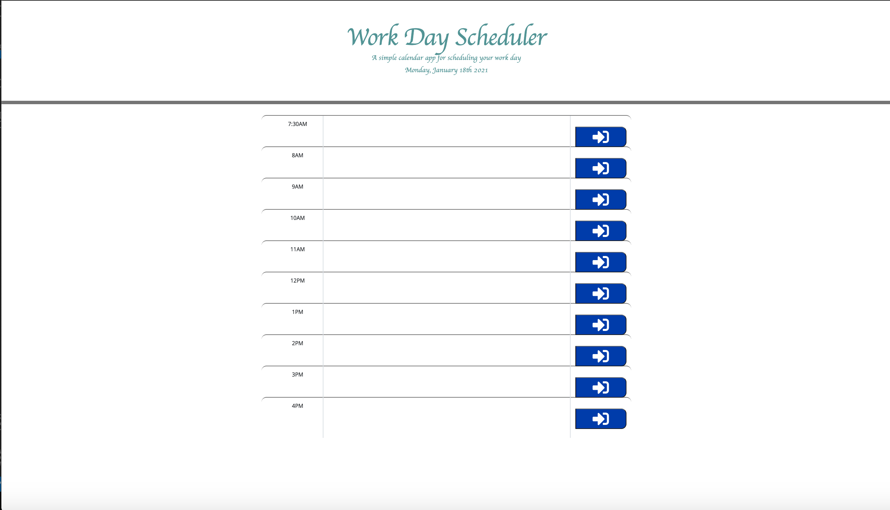

# work-day-scheduler

This project is created to make a workday scheduler/planner.
In this project, you can see the usage of moment.js where you can see the exact day in the jumbotron.
Under the jumbotron is the timeblocks from 7:30 - 4pm where you can add your plans for the day and save it using the button on the side of it.

